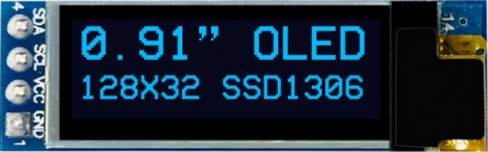

# OLED Display SSD1306 128x32 Example

This project communicates with the SSD1306 128x32 OLED Display ([pdf](docs/SSD1306.pdf)): 

#### It was interesting challenge during the project implementation.
It was challenging to print data to the 128x32 display in the same way we expected after reading about printing to the 128x64 display. If you are interested, please look at the [description of the task and solution](docs/Ch01_LostBits.md).

#### The project *in vivo*: 

#### The ESP32 Microcontroller pinout: 

