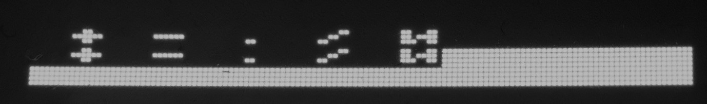
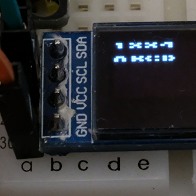
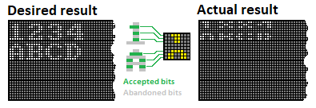
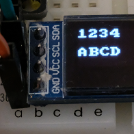

# Printing the text on the Display

Based on the ([display documentation.pdf](docs/SSD1306.pdf)) we have lines (named "pages") in the screen. Each "page" represented by line with 8 pixel height and 128 pixel width.

We have a [font file](../main/font08x08.h) that contains eight bytes for every symbol that can be displayed on the screen by our software. It looks like that's enough to prepare a bit array [128x8] bits, that is array with 128 bytes, filled with bytes in the places we want to see a symbols. Looks good and understandable. Let's fill the display with white points (just for fun) ant then put two lines: " + - / . 0 " over them.

The result we received is far from the expected.
- We have the suspicious nerrow lins with height 4 pixel instead of 8.
- It looks like the screen contains 8 lines with 4 pixel height instead of 4 line with 8 pixel height.
- The symbols we have on the screen are corrupted.

Let's take a look onto the font.

All looks good. Let's make another experiment. Try to print two lines:

"1234" and "ABCD"

That's look more understandable. Let's take a deeper look into the pixels.

It looks more clean now. Remember the documentation. It writes only about 8-line (or, 8-page) screen. Not a word about 4-line screen. It looks like developers of the controller developed it for the 8-line screens only, but later, display developers, found out the solution how to employ it for the different types of scrrens.

The controller when it works with 4-line screen, connected to the even points only. It takes not every bit from the byte sent to it, but even ones. And it can thinks that he is still working with 8 line screen, why not.

So, when we deal with narrow display, we need to split every byte to even and not even bits and send one half-byte as a byte for the first line, and second half-byte to the second line. We must do it for every couple of screen'd half line, and the every couple of half line on the screen represents the one whole line of the display. So, the controller think that it sends two lines to the 8-line screen but actually it sends two modified half-lines to the two half-lines of the screen. 

That's how they use one type of the controller for the two types of the screen. Great decicion, isnt it?

Next step, we divide every byte of our 128-byte line of bits, imprinted there according to our input string and font, and, finaly, we have a text on the screen that does not look crazy, but it looks exactly as we wanted.

